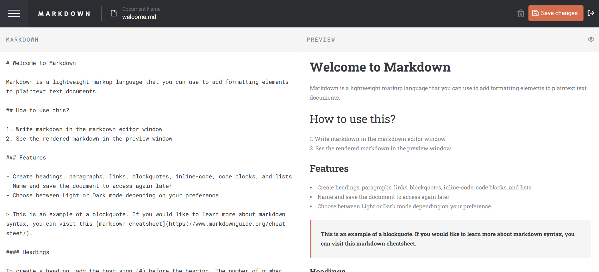

# Frontend Mentor - In-browser markdown editor solution

This is a solution to the [In-browser markdown editor challenge on Frontend Mentor](https://www.frontendmentor.io/challenges/inbrowser-markdown-editor-r16TrrQX9). Frontend Mentor challenges help you improve your coding skills by building realistic projects.

## Table of contents

- [Overview](#overview)
  - [The challenge](#the-challenge)
  - [Screenshot](#screenshot)
  - [Links](#links)
- [My process](#my-process)
  - [Built with](#built-with)
  - [What I learned](#what-i-learned)
  - [Useful resources](#useful-resources)
- [Author](#author)

## Overview

### The challenge

Users should be able to:

- Create, Read, Update, and Delete markdown documents
- Name and save documents to be accessed as needed
- Edit the markdown of a document and see the formatted preview of the content
- View a full-page preview of the formatted content
- View the optimal layout for the app depending on their device's screen size
- See hover states for all interactive elements on the page
- Build this project as a full-stack application

### Screenshot

### Links

- Live Site URL: [Add live site URL here](https://markdowneditorfullstack.netlify.app/)

## My process

### Built with

- Semantic HTML5 markup
- CSS custom properties
- Flexbox
- CSS Grid
- Mobile-first workflow
- [React](https://reactjs.org/) - JS library
- [Styled Components](https://styled-components.com/) - For styles
- [Node.js](https://nodejs.org/) - For backend
- [MongoBD Atlas](https://www.mongodb.com/) - for DB
- [mongoose](https://mongoosejs.com/) - object modeling for Node.js

### What I learned

This is my first full-stack project, where I gained valuable insights into backend development. I learned how the front end and backend integrate seamlessly, how to write routes and middleware, and developed proficiency in MongoDB and Mongoose.

### Useful resources

- [Jonas's Udemy course](https://www.udemy.com/course/nodejs-express-mongodb-bootcamp) - This hepled me with the BE side of things

## Author

- Frontend Mentor - [@MarinaDur](https://www.frontendmentor.io/profile/MarinaDur)
